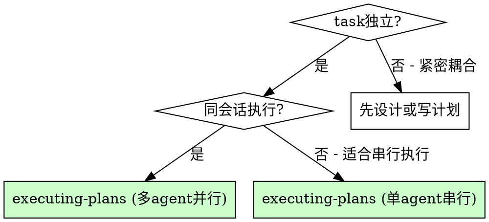

# 执行计划 (多智能体并行)

通过为每个任务分派专用子智能体来执行计划，每个任务独立实现、独立审查。整合了单智能体执行、多智能体并行分派、以及子智能体驱动开发的能力。

**核心原则：** 每个任务一个全新子智能体 + 两阶段审查（先规格后质量）= 高质量、快速迭代。

**开始前检查：**
- [ ] 是否存在 `docs/plans/` 下的计划文件？→ 直接加载
- [ ] 是否已有设计文档但无计划？→ 使用 `writing-plans` 先生成计划
- [ ] 既无设计也无计划？→ 使用 `grill-with-docs` 从设计开始

## 决策树：选择执行模式



**多智能体并行：** 任务之间基本独立，每个任务分配独立子智能体并行执行，带两阶段审查。推荐用于 2 个以上独立任务。

**单智能体串行：** 任务有顺序依赖，或子智能体不可用。在当前会话中逐个执行，批量审查。

## 通用流程

### 步骤 1：加载并审查计划

1. 读取计划文件（`docs/plans/<feature>.md`）
2. 批判性审查——识别计划中的任何问题或疑虑：
   - 步骤之间是否有依赖遗漏？
   - 验证条件是否明确？
   - 是否有隐含的环境假设？
3. 如果有疑虑：向用户提出
4. 如果没有疑虑：创建 TodoWrite 并继续

### 步骤 2：拆解任务

将计划拆分为独立的任务单元。识别任务间的依赖关系：
- **独立任务** → 可并行分派
- **有依赖的任务** → 串行执行，或合并为一个任务

## 模式 A：多智能体并行执行

为每个独立任务分派一个全新子智能体。每个子智能体获得完整上下文但不继承会话历史。

### 分派实现子智能体

每个子智能体获得：
- **明确范围：** 一个任务或子系统
- **清晰目标：** 完成任务，遵循 TDD
- **约束条件：** 不修改其他任务的代码
- **预期输出：** 完成总结

使用 `implementer-prompt.md` 作为子智能体的指令基础，附加以下上下文：
- 任务完整文本和完成标准
- 要创建/修改的文件路径
- 相关的 `docs/design/` 和 `docs/adr/` 上下文
- 使用 **caveman 模式**与子智能体通信——简洁指令，减少 token 消耗，避免历史压缩丢失关键信息

### 处理子智能体状态

| 状态 | 含义 | 处理方式 |
|------|------|---------|
| **DONE** | 完成实现 | 进入审查 |
| **DONE_WITH_CONCERNS** | 完成但有疑虑 | 阅读疑虑。如果涉及正确性，在审查前解决 |
| **NEEDS_CONTEXT** | 缺少信息 | 提供缺失上下文并重新分派 |
| **BLOCKED** | 无法完成 | 评估原因：上下文不足则补充，任务太大则拆分，计划有问题则上报 |

### 两阶段审查

每个任务在实现后必须经过两阶段审查，**顺序不可颠倒**：

**阶段 1：规格合规性审查**
- 使用 `spec-reviewer-prompt.md` 分派审查子智能体
- 验证代码是否匹配设计规格
- 审查者发现问题 → 实现子智能体修复 → 再次审查

**阶段 2：代码质量审查**
- 使用 `code-quality-reviewer-prompt.md` 分派审查子智能体
- 验证代码质量、测试覆盖、架构合理性
- 审查者发现问题 → 实现子智能体修复 → 再次审查

**红线：**
- 绝不在规格合规性审查通过之前开始代码质量审查
- 绝不在任一审查有未解决问题时进入下一个任务
- 绝不用实现者的自审替代正式审查（两者都需要）

### 模型选择

| 任务类型 | 推荐模型 |
|---------|---------|
| 机械性实现（1-2 文件，清晰规格） | 快速/便宜模型 |
| 多文件协调、集成、调试 | 标准模型 |
| 架构、设计、审查 | 最强可用模型 |

## 模式 B：单智能体串行执行

当子智能体不可用或任务紧密耦合时，在当前会话中逐个执行任务。

对于每个任务：
1. **标记为进行中** — 更新 TodoWrite
2. **理解目标** — 重读任务描述，明确完成标准
3. **执行实现** — 严格按照计划步骤执行
4. **运行验证** — 按要求运行测试或检查
5. **提交变更** — 每完成一个任务提交一次
6. **标记为已完成** — 更新 TodoWrite

**每 3 个任务后**暂停回顾：整体方向还对吗？有没有偏离计划？

## 模式 C：并行分派独立调试任务

当遇到多个不相关的失败（不同的测试文件、不同的子系统），可以并行分派调试智能体。

**适用条件：**
- 3 个以上独立失败，每个的根因互不相关
- 每个问题无需其他问题的上下文即可理解
- 调试之间无共享状态

**流程：**
1. 识别独立的问题域（按失败的文件/子系统分组）
2. 为每个问题域创建一个聚焦的智能体任务，包含：
   - 明确范围（一个测试文件或子系统）
   - 清晰目标（让这些测试通过）
   - 约束条件（不修改其他代码）
   - 预期输出（根因 + 修复总结）
3. 并行分派所有智能体
4. 审查每个总结，检查冲突，运行完整测试套件

**不适用的场景：**
- 失败是相关的（修复一个可能修复其他的）
- 需要理解完整的系统状态
- 智能体之间会互相干扰（编辑同一文件、使用同一资源）

## 处理常见异常

**测试失败：**
1. 读错误信息，定位失败原因
2. 区分：是实现 bug？测试本身有问题？计划描述有误？
3. 实现 bug → 修复并重跑
4. 测试有问题 → 修复测试，向用户说明
5. 计划有误 → 停下来，向用户报告

**依赖缺失：**
- 停止执行
- 向用户报告缺失的依赖，建议插入配置步骤

**指令不清：**
- 不要猜测意图，不要"合理推断"
- 列出你的理解和困惑，让用户澄清

## 验证与完成

所有任务完成后：
- 运行完整测试套件
- 审查所有变更的集成
- 使用 `finishing-a-development-branch` 收尾

**完成报告模板：**
```markdown
## 执行报告

**计划：** docs/plans/<feature>.md
**执行模式：** 多智能体并行 / 单智能体串行 / 并行调试
**任务：** N/N 已完成

### 完成的任务
1. ✅ 任务 1
2. ✅ 任务 2

### 验证结果
- 单元测试：X/X 通过
- 集成测试：X/X 通过

### 偏离计划的地方
- （如有偏离，记录原因和用户确认）

### 下一步
使用 finishing-a-development-branch 处理合并/PR
```

## 集成

**输入：**
- **writing-plans** — 创建 `docs/plans/` 下的计划文件
- **grill-with-docs** — 创建 `docs/design/` 下的设计文档

**输出：**
- **finishing-a-development-branch** — 所有任务完成后收尾
- **requesting-code-review** — 整体代码审查

**子智能体应使用：**
- **test-driven-development** — 子智能体对每个任务遵循 TDD
- **caveman** — 子智能体交互使用压缩格式，减少 token 消耗

**工作流技能：**
- **using-git-worktrees** — 开始前建立隔离工作空间（推荐）