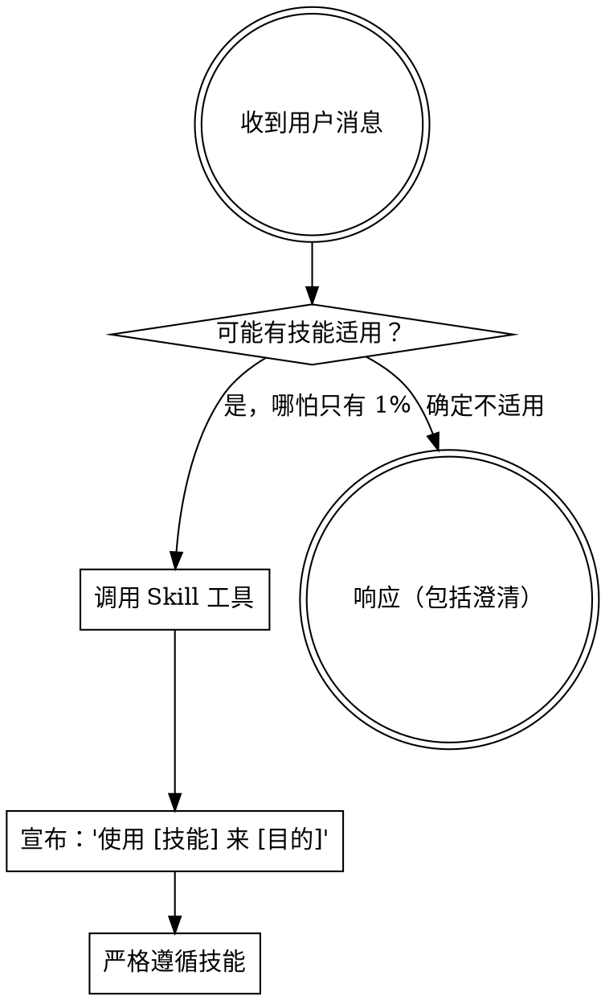

<SUBAGENT-STOP>
如果你是作为子智能体被分派来执行特定任务的，跳过此技能。
</SUBAGENT-STOP>

<EXTREMELY-IMPORTANT>
如果你认为哪怕只有 1% 的可能性某个技能适用于你正在做的事情，你绝对必须调用该技能。

如果一个技能适用于你的任务，你没有选择。你必须使用它。

这不可协商。这不是可选的。你不能通过合理化来逃避。
</EXTREMELY-IMPORTANT>

## 技能优先级

Oh My Superpowers 技能覆盖默认系统提示行为，但**用户指令始终具有最高优先级**：

1. **用户的明确指令**（CLAUDE.md、AGENTS.md、直接请求）——最高优先级
2. **Oh My Superpowers 技能** ——在冲突处覆盖默认系统行为
3. **默认系统提示** ——最低优先级

## 工具链概览

```
grill-with-docs (设计) ──→ writing-plans (计划) ──→ executing-plans (执行)
                                           
辅助技能: test-driven-development、diagnose、caveman
审查技能: requesting-code-review、receiving-code-review
收尾技能: finishing-a-development-branch、using-git-worktrees
```

### 端到端模式

**模式 1（设计 + 计划）：**
1. `grill-with-docs` — 拷问想法，打磨术语，输出 CONTEXT.md + ADR + `docs/design/`
2. `writing-plans` — 从 `docs/design/` 读取，输出 `docs/plans/`

**模式 2（设计 + 计划 + 执行）：**
1. `grill-with-docs` — 同上
2. `writing-plans` — 同上
3. `executing-plans` — 从 `docs/plans/` 读取，多智能体并行执行

## 如何访问技能

**在 Claude Code 中：** 使用 `Skill` 工具。当你调用一个技能时，其内容会被加载并呈现给你——直接遵循即可。绝不要用 Read 工具读取技能文件。

**在其他环境中：** 查看你的平台文档了解技能的加载方式。

## 使用技能

**在任何响应或操作之前调用相关或被请求的技能。** 哪怕只有 1% 的可能性某个技能适用，你都应该调用该技能来检查。



## 红线

| 想法 | 现实 |
|------|------|
| "这只是一个简单的问题" | 问题就是任务。检查技能。 |
| "我需要先了解更多上下文" | 技能检查在澄清性问题之前。 |
| "让我先探索一下代码库" | 技能告诉你如何探索。先检查。 |
| "这不需要正式的技能" | 如果技能存在，就使用它。 |
| "我记得这个技能" | 技能会迭代更新。阅读当前版本。 |
| "技能太小题大做了" | 简单的事会变复杂。使用它。 |

## 中国特色技能路由

当检测到以下场景时，**必须**优先调用对应的中国特色技能：

| 场景 | 调用技能 |
|------|---------|
| 代码审查且团队使用中文沟通 | **oh-my-superpowers:chinese-code-review** |
| 使用 Gitee/Coding/极狐 GitLab | **oh-my-superpowers:chinese-git-workflow** |
| 编写中文技术文档或 README | **oh-my-superpowers:chinese-documentation** |
| 编写 git commit message（中文项目） | **oh-my-superpowers:chinese-commit-conventions** |

## 技能类型

**刚性的**（TDD、调试）：严格遵循。不要偏离纪律。

**灵活的**（模式）：根据上下文调整原则。

技能本身会告诉你它属于哪种。